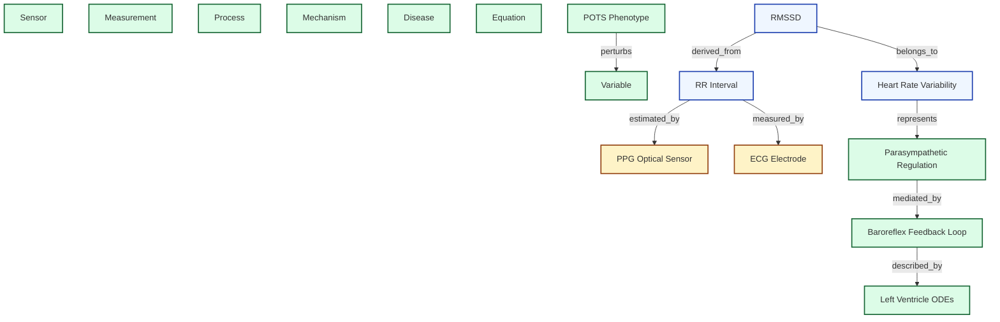

# Computational Physiology Ontology & Schemas

This document defines the structure of the formal ontology and presents the updated metadata schemas for variables, relationships, diseases, and wearables.

---

## 1. Ontology Conceptual Graph

The ontology represents semantic physiological concepts and the causal relationships between them.



---

## 2. Updated Metadata Schemas

### A. Variable Schema (`knowledge_base/physiology/*.yaml`)
Every physiological or latent state variable is defined using the following structure:
```yaml
version: string
variables: # or latent_variables
  - symbol: string         # Unique short symbol (e.g. "Vau")
    name: string           # Human-readable name
    category: string       # e.g., "cardiovascular", "autonomic", "respiratory"
    description: string    # Detailed clinical/physiological description
    units: string          # Standard scientific units (e.g., "ml", "mmHg", "bps")
    valid_range:           # Valid bounds to ensure physiological plausibility
      min: float
      max: float
```

### B. Mechanistic Links Schema (`knowledge_base/ontology/mechanistic_links.yaml`)
Causal relationships representing mechanical linkages:
```yaml
version: string
relationships:
  - relationship_id: string         # Unique ID (e.g., "pcm_to_Hc")
    cause: string                   # Source variable symbol
    effect: string                  # Target variable symbol
    type: string                    # Causal shape (e.g., "sigmoid_hill", "first_order_ode")
    evidence_score: float           # 1-10 confidence metric
    supporting_publications:
      - doi: string                 # Sourced DOI
        citation_keys: list of string
        population_cohorts: list of string
    mathematical_ref: string        # Path to LaTeX equation registry
```

### C. Equation Schema (`knowledge_base/equations/definitions.yaml`)
Canonical mathematical representation:
```yaml
version: string
equations:
  - id: string            # Unique identifier
    label: string         # Equation title
    latex: string         # LaTeX mathematical formula
    inputs: list of string # Sourced state variables
    parameters: list of string # Constant symbols
    outputs: list of string # Solved state variables
    description: string   # Physical rationale
```

### D. Wearable Sensor Validation Schema (`knowledge_base/wearables/*.yaml`)
Device specifications and validation bounds:
```yaml
version: string
sensor:
  id: string
  name: string
  type: string            # e.g., "dry_electrode_ecg", "optical_ppg"
  manufacturer: string
  specifications:
    sampling_frequency: float # Hz
    rr_resolution_ms: float
  validation:
    - parameters_evaluated: list of string
      icc: float
      pearson_r: float
      bias: float
      loa_lower: float
      loa_upper: float
      exercise_intensity: string # "rest", "low_intensity", "high_intensity"
      reference_device: string
      provenance:
        doi: string
  failure_modes: list of string
  motion_artifact_handling: string
```
